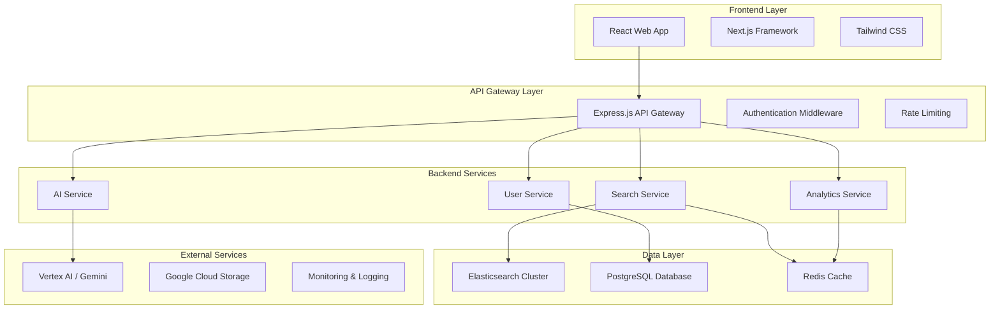

# Design Document - CollectiveMind Full-Stack Application

## Overview

The CollectiveMind application is a modern, cloud-native platform that combines Elasticsearch's hybrid search capabilities with Google Cloud's Vertex AI to create an intelligent organizational memory system. The architecture follows microservices principles with a React frontend, Node.js backend services, and integrated AI capabilities for search, summarization, and serendipity discovery.

## Architecture

### High-Level System Architecture



### Technology Stack

**Frontend:**
- React 18 with TypeScript
- Next.js 14 for SSR and routing
- Tailwind CSS for styling
- React Query for state management
- Socket.io for real-time features

**Backend:**
- Node.js with Express.js
- TypeScript for type safety
- Prisma ORM for database operations
- Redis for caching and sessions
- Winston for logging

**Data & Search:**
- Elasticsearch 8.x for hybrid search
- PostgreSQL for relational data
- Redis for caching and real-time features

**AI & Cloud:**
- Google Cloud Vertex AI for embeddings
- Gemini API for conversational AI
- Google Cloud Storage for file storage
- Google Cloud Monitoring
## 
Components and Interfaces

### Frontend Architecture

**Component Structure:**
```
src/
├── components/
│   ├── search/
│   │   ├── SearchBar.tsx
│   │   ├── SearchResults.tsx
│   │   ├── FilterPanel.tsx
│   │   └── ResultCard.tsx
│   ├── chat/
│   │   ├── ChatInterface.tsx
│   │   ├── MessageBubble.tsx
│   │   └── ConversationHistory.tsx
│   ├── dashboard/
│   │   ├── PersonaDashboard.tsx
│   │   ├── SerendipityPanel.tsx
│   │   └── ActivityFeed.tsx
│   └── common/
│       ├── Layout.tsx
│       ├── Navigation.tsx
│       └── LoadingSpinner.tsx
├── pages/
│   ├── search/
│   ├── dashboard/
│   ├── onboarding/
│   └── api/
├── hooks/
│   ├── useSearch.ts
│   ├── useAI.ts
│   └── usePersona.ts
├── services/
│   ├── api.ts
│   ├── search.ts
│   └── ai.ts
└── types/
    ├── search.ts
    ├── user.ts
    └── ai.ts
```

### Backend Service Architecture

**Search Service:**
- Elasticsearch integration with hybrid search
- Vector similarity search using embeddings
- Result ranking and personalization
- Access control and filtering

**AI Service:**
- Vertex AI integration for embeddings
- Gemini API for conversational responses
- Context management for conversations
- Serendipity detection algorithms

**User Service:**
- Authentication and authorization
- User profile and preferences
- Team and role management
- Activity tracking

**Analytics Service:**
- Usage metrics and performance monitoring
- Search analytics and success rates
- Cross-team collaboration tracking
- Business impact measurement

## Data Models

### Elasticsearch Index Schemas

**Documents Index:**
```json
{
  "mappings": {
    "properties": {
      "doc_id": {"type": "keyword"},
      "title": {"type": "text", "analyzer": "standard"},
      "content": {"type": "text", "analyzer": "standard"},
      "content_vector": {"type": "dense_vector", "dims": 768},
      "team": {"type": "keyword"},
      "author_person_id": {"type": "keyword"},
      "tags": {"type": "keyword"},
      "created_at": {"type": "date"},
      "updated_at": {"type": "date"},
      "visibility": {"type": "keyword"},
      "confidentiality": {"type": "keyword"}
    }
  }
}
```

**Messages Index:**
```json
{
  "mappings": {
    "properties": {
      "message_id": {"type": "keyword"},
      "thread_id": {"type": "keyword"},
      "sender_person_id": {"type": "keyword"},
      "text": {"type": "text", "analyzer": "standard"},
      "text_vector": {"type": "dense_vector", "dims": 768},
      "emotions": {"type": "keyword"},
      "timestamp": {"type": "date"},
      "channel": {"type": "keyword"}
    }
  }
}
```

### PostgreSQL Schema

**Users Table:**
```sql
CREATE TABLE users (
  id UUID PRIMARY KEY DEFAULT gen_random_uuid(),
  person_id VARCHAR(50) UNIQUE NOT NULL,
  email VARCHAR(255) UNIQUE NOT NULL,
  full_name VARCHAR(255) NOT NULL,
  team VARCHAR(100) NOT NULL,
  role_title VARCHAR(255) NOT NULL,
  manager_id VARCHAR(50),
  created_at TIMESTAMP DEFAULT NOW(),
  updated_at TIMESTAMP DEFAULT NOW()
);
```

**Search Sessions Table:**
```sql
CREATE TABLE search_sessions (
  id UUID PRIMARY KEY DEFAULT gen_random_uuid(),
  user_id UUID REFERENCES users(id),
  session_start TIMESTAMP DEFAULT NOW(),
  queries JSONB,
  results_clicked JSONB,
  conversation_context JSONB
);
```## API De
sign

### REST API Endpoints

**Search API:**
```
POST /api/search
- Body: { query, filters, user_context }
- Response: { results, suggestions, related_teams, people }

GET /api/search/suggestions?q={query}
- Response: { suggestions, recent_searches }

POST /api/search/feedback
- Body: { query_id, result_id, feedback_type }
- Response: { success }
```

**AI API:**
```
POST /api/ai/chat
- Body: { message, conversation_id, context }
- Response: { response, citations, suggestions }

POST /api/ai/summarize
- Body: { content_ids, summary_type }
- Response: { summary, key_points, citations }

GET /api/ai/serendipity
- Response: { opportunities, confidence_scores }
```

**User API:**
```
GET /api/user/profile
- Response: { user_info, preferences, team_info }

POST /api/user/activity
- Body: { event_type, resource_id, context }
- Response: { success }

GET /api/user/recommendations
- Response: { documents, people, topics }
```

### WebSocket Events

**Real-time Search:**
```javascript
// Client to Server
socket.emit('search:start', { query, filters });
socket.emit('search:refine', { query_id, refinements });

// Server to Client  
socket.on('search:results', { results, metadata });
socket.on('search:suggestions', { suggestions });
```

**AI Conversations:**
```javascript
// Client to Server
socket.emit('ai:message', { message, conversation_id });

// Server to Client
socket.on('ai:response', { response, typing: false });
socket.on('ai:typing', { typing: true });
```

## Search Implementation

### Hybrid Search Strategy

**Query Processing Pipeline:**
1. **Query Analysis**: Parse user intent, extract entities
2. **Keyword Search**: Traditional Elasticsearch BM25 scoring
3. **Vector Search**: Semantic similarity using embeddings
4. **Result Fusion**: Combine and rank results using RRF (Reciprocal Rank Fusion)
5. **Personalization**: Boost results based on user context
6. **Access Control**: Filter results based on permissions

**Embedding Generation:**
- Use Vertex AI text-embedding-004 model
- Generate embeddings for documents, messages, and queries
- Store embeddings in Elasticsearch dense_vector fields
- Batch processing for efficient embedding generation

**Ranking Algorithm:**
```javascript
final_score = (
  keyword_score * 0.4 +
  semantic_score * 0.4 +
  recency_boost * 0.1 +
  team_relevance * 0.1
) * access_control_multiplier
```

### Personalization Engine

**User Context Factors:**
- Team membership and role
- Recent search history
- Document interaction patterns
- Cross-team collaboration history
- Expertise areas and interests

**Dynamic Boosting:**
- Same team content: +20% boost
- Cross-team interests: +10% boost
- Recent activity: +15% boost
- Expertise match: +25% boost

## AI Integration

### Vertex AI Services

**Text Embeddings:**
- Model: text-embedding-004
- Dimensions: 768
- Use cases: Search, similarity, clustering

**Gemini Integration:**
- Model: gemini-1.5-pro
- Use cases: Summarization, Q&A, insights
- Context window: 1M tokens
- Streaming responses for real-time chat

### Conversation Management

**Context Preservation:**
```javascript
{
  conversation_id: "uuid",
  user_id: "user_uuid", 
  messages: [
    {
      role: "user",
      content: "Tell me about customer churn",
      timestamp: "2025-01-01T10:00:00Z"
    },
    {
      role: "assistant", 
      content: "Based on recent analysis...",
      citations: ["DOC_021", "DOC_083"],
      timestamp: "2025-01-01T10:00:05Z"
    }
  ],
  context: {
    search_results: [...],
    user_team: "Product",
    related_topics: ["churn", "retention"]
  }
}
```

### Serendipity Detection

**Cross-Team Opportunity Algorithm:**
1. Analyze user's current activity and interests
2. Find similar content from other teams
3. Identify potential collaboration points
4. Calculate confidence scores based on:
   - Content similarity (semantic)
   - Timing relevance
   - Team interaction history
   - Success patterns

**Confidence Scoring:**
```javascript
confidence = (
  content_similarity * 0.4 +
  timing_relevance * 0.2 +
  team_compatibility * 0.2 +
  historical_success * 0.2
)
```#
# Security and Access Control

### Authentication & Authorization

**JWT-based Authentication:**
- Access tokens (15 minutes expiry)
- Refresh tokens (7 days expiry)
- Role-based access control (RBAC)
- Team-based permissions

**Permission Matrix:**
```javascript
{
  "public": ["Marketing", "Product", "Engineering", "Finance", "HR"],
  "internal": ["same_team", "managers"],
  "restricted": ["same_team"],
  "confidential": ["author", "co_authors", "managers"]
}
```

**Access Control Implementation:**
- Middleware validates JWT tokens
- User context injected into all requests
- Elasticsearch queries filtered by permissions
- Document-level security using ACLs

### Data Privacy

**PII Protection:**
- All synthetic data (no real PII)
- Data anonymization for analytics
- GDPR-compliant data handling
- Audit logging for access patterns

**Security Headers:**
- CORS configuration
- CSP (Content Security Policy)
- HSTS (HTTP Strict Transport Security)
- Rate limiting and DDoS protection

## Performance Optimization

### Caching Strategy

**Multi-Level Caching:**
1. **Browser Cache**: Static assets, API responses (5 minutes)
2. **CDN Cache**: Global content delivery
3. **Redis Cache**: Search results, user sessions, AI responses
4. **Application Cache**: Frequently accessed data

**Cache Keys:**
```javascript
// Search results
`search:${user_id}:${query_hash}:${filters_hash}`

// AI responses  
`ai:${conversation_id}:${message_hash}`

// User recommendations
`recommendations:${user_id}:${date}`
```

### Database Optimization

**Elasticsearch:**
- Index templates for consistent mapping
- Index lifecycle management (ILM)
- Shard optimization based on data volume
- Query optimization with profiling

**PostgreSQL:**
- Connection pooling with pgBouncer
- Read replicas for analytics queries
- Proper indexing on frequently queried fields
- Query optimization with EXPLAIN ANALYZE

### Monitoring and Observability

**Application Metrics:**
- Response times and throughput
- Error rates and success metrics
- User engagement and retention
- Search success and abandonment rates

**Infrastructure Metrics:**
- CPU, memory, and disk usage
- Network latency and bandwidth
- Database performance metrics
- Elasticsearch cluster health

**Logging Strategy:**
- Structured logging with Winston
- Centralized log aggregation
- Error tracking and alerting
- Performance monitoring with APM

## Deployment Architecture

### Container Strategy

**Docker Containers:**
```dockerfile
# Frontend (Next.js)
FROM node:18-alpine
WORKDIR /app
COPY package*.json ./
RUN npm ci --only=production
COPY . .
RUN npm run build
EXPOSE 3000
CMD ["npm", "start"]

# Backend Services
FROM node:18-alpine
WORKDIR /app
COPY package*.json ./
RUN npm ci --only=production
COPY . .
RUN npm run build
EXPOSE 8000
CMD ["npm", "start"]
```

### Cloud Infrastructure

**Google Cloud Platform:**
- **Compute**: Google Kubernetes Engine (GKE)
- **Database**: Cloud SQL (PostgreSQL)
- **Search**: Elasticsearch on Compute Engine
- **AI**: Vertex AI and Gemini API
- **Storage**: Cloud Storage for assets
- **Monitoring**: Cloud Monitoring and Logging

**Kubernetes Deployment:**
```yaml
apiVersion: apps/v1
kind: Deployment
metadata:
  name: collectivemind-api
spec:
  replicas: 3
  selector:
    matchLabels:
      app: collectivemind-api
  template:
    metadata:
      labels:
        app: collectivemind-api
    spec:
      containers:
      - name: api
        image: gcr.io/project/collectivemind-api:latest
        ports:
        - containerPort: 8000
        env:
        - name: DATABASE_URL
          valueFrom:
            secretKeyRef:
              name: db-secret
              key: url
```

### CI/CD Pipeline

**GitHub Actions Workflow:**
1. **Code Quality**: ESLint, Prettier, TypeScript checks
2. **Testing**: Unit tests, integration tests, E2E tests
3. **Security**: Dependency scanning, SAST analysis
4. **Build**: Docker image creation and optimization
5. **Deploy**: Automated deployment to staging/production
6. **Monitoring**: Health checks and rollback capabilities

This comprehensive design provides a robust, scalable foundation for the CollectiveMind application that effectively demonstrates the power of combining Elasticsearch hybrid search with Vertex AI intelligence.