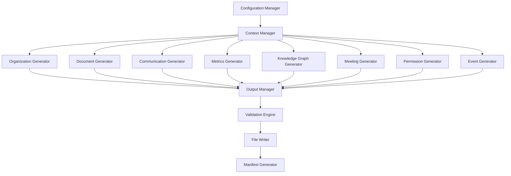

# Design Document - Synthetic Dataset Generator

## Overview

The Synthetic Dataset Generator is a Python-based system that creates comprehensive, realistic organizational datasets for CollectiveMind. The system uses a modular architecture with specialized generators for different data types, ensuring consistency through shared context and cross-references. The design emphasizes data realism, referential integrity, and configurable output formats suitable for Elastic indexing and Vertex AI processing.

## Architecture

### High-Level Architecture



### Core Components

1. **Configuration Manager**: Manages generation parameters, output formats, and data volume settings
2. **Context Manager**: Maintains shared state and ensures referential integrity across generators
3. **Specialized Generators**: Domain-specific data generators for each data type
4. **Output Manager**: Handles JSONL/CSV formatting and file organization
5. **Validation Engine**: Ensures data quality, consistency, and format compliance
6. **Manifest Generator**: Creates comprehensive metadata about generated datasets

## Components and Interfaces

### Context Manager

The Context Manager serves as the central coordination point, maintaining:

- **Organization Context**: Teams, people, roles, and hierarchies
- **Temporal Context**: Timeline management and event sequencing
- **Reference Registry**: ID tracking and cross-reference validation
- **Content Templates**: Reusable content patterns and themes

```python
class ContextManager:
    def __init__(self):
        self.people: Dict[str, Person] = {}
        self.teams: List[str] = ["Marketing", "Product", "Engineering", "Finance", "HR"]
        self.documents: Dict[str, Document] = {}
        self.topics: Dict[str, Topic] = {}
        self.timeline: Timeline = Timeline()
        
    def register_entity(self, entity_type: str, entity_id: str, entity: Any) -> None
    def get_random_person(self, team: Optional[str] = None) -> Person
    def get_related_documents(self, topic: str, team: str) -> List[Document]
    def ensure_referential_integrity(self) -> ValidationResult
```

### Organization Generator

Generates the foundational organizational structure:

- **People Generation**: Creates realistic employee profiles with skills, tenure, and team history
- **Team Structure**: Establishes reporting relationships and cross-team connections
- **Role Distribution**: Ensures realistic role hierarchies and specializations

Key algorithms:
- Weighted random assignment for team changes and promotions
- Skill clustering based on role and team requirements
- Realistic tenure and timezone distribution

### Document Generator

Creates diverse document types with realistic content:

- **Content Templates**: Domain-specific templates for each team's document types
- **Version Management**: Tracks document evolution and maintains version histories
- **Cross-References**: Generates realistic document relationships and citations

Document types by team:
- Engineering: RFCs, architecture docs, postmortems, research memos
- Product: PRDs, decision logs, feature specs, user research
- Marketing: Campaign reports, competitive analysis, customer insights
- Finance: Quarterly reports, risk assessments, budget analyses
- HR: Policies, onboarding guides, performance frameworks

### Communication Generator

Simulates realistic organizational communication patterns:

- **Thread Generation**: Creates conversation flows with realistic participation patterns
- **Emotional Modeling**: Assigns emotional context based on topic and timing
- **Cross-Team Dynamics**: Models collaboration patterns and information silos

Communication patterns:
- Daily standup threads with regular participants
- Project-specific channels with milestone-driven activity
- Cross-team coordination with escalation patterns
- Random/social channels with lighter engagement

### Knowledge Graph Generator

Creates semantic relationships between organizational entities:

- **Entity Extraction**: Identifies key entities from generated content
- **Relationship Inference**: Generates weighted edges based on co-occurrence and context
- **Topic Modeling**: Creates topic hierarchies and emerging trend detection
- **Serendipity Detection**: Identifies cross-team overlap opportunities

Edge weight calculation:
```
weight = (co_occurrence_frequency * 0.4) + 
         (temporal_proximity * 0.3) + 
         (semantic_similarity * 0.3)
```

## Data Models

### Core Entity Models

```python
@dataclass
class Person:
    person_id: str
    full_name: str
    email: str
    role_title: str
    team: str
    manager_id: Optional[str]
    skills: List[str]
    tenure_months: int
    active: bool
    previous_teams: List[str]
    timezone: str

@dataclass
class Document:
    doc_id: str
    title: str
    content: str
    team: str
    author_person_id: str
    co_authors: List[str]
    tags: List[str]
    created_at: datetime
    updated_at: datetime
    status: str  # draft/final
    visibility: str  # public/internal/restricted
    source_type: str
    language: str
    confidentiality: str  # low/medium/high
    related_doc_ids: List[str]

@dataclass
class KnowledgeGraphEdge:
    edge_id: str
    edge_type: str
    src_type: str
    src_id: str
    dst_type: str
    dst_id: str
    weight: float
    first_seen_at: datetime
    last_seen_at: datetime
    evidence: str
```

### Temporal Modeling

The system uses a timeline-based approach to ensure realistic temporal relationships:

- **Event Sequencing**: Documents, meetings, and communications follow logical temporal order
- **Seasonal Patterns**: Business cycles, quarterly reviews, and project milestones
- **Realistic Delays**: Communication gaps, document review cycles, and decision timelines

## Error Handling

### Data Consistency Validation

- **Reference Validation**: Ensures all person_id, doc_id, and team references are valid
- **Temporal Consistency**: Validates that events occur in logical chronological order
- **Content Quality**: Checks for realistic content length, format, and structure

### Error Recovery Strategies

- **Graceful Degradation**: Continues generation with warnings for non-critical errors
- **Reference Repair**: Automatically fixes broken references where possible
- **Content Fallbacks**: Uses template content when generation fails

### Validation Rules

```python
class ValidationEngine:
    def validate_references(self, data: Dict) -> List[ValidationError]
    def validate_temporal_consistency(self, events: List[Event]) -> List[ValidationError]
    def validate_content_quality(self, content: str, content_type: str) -> List[ValidationError]
    def validate_output_format(self, file_path: str, format_type: str) -> List[ValidationError]
```

## Testing Strategy

### Unit Testing

- **Generator Testing**: Each generator component tested in isolation
- **Context Manager Testing**: State management and reference tracking validation
- **Data Model Testing**: Serialization, validation, and constraint checking

### Integration Testing

- **End-to-End Generation**: Full dataset generation with validation
- **Cross-Reference Testing**: Validates referential integrity across all data types
- **Format Compliance**: Ensures JSONL and CSV output meets specifications

### Data Quality Testing

- **Statistical Validation**: Checks for realistic distributions and patterns
- **Content Analysis**: Validates generated content for coherence and realism
- **Performance Testing**: Ensures generation completes within acceptable timeframes

### Test Data Scenarios

- **Minimal Dataset**: Small-scale generation for rapid testing
- **Edge Case Testing**: Boundary conditions and error scenarios
- **Scale Testing**: Full-volume generation performance validation

## Performance Considerations

### Generation Optimization

- **Batch Processing**: Groups related operations for efficiency
- **Memory Management**: Streams large datasets to avoid memory issues
- **Parallel Generation**: Independent generators can run concurrently

### Output Optimization

- **Streaming Writers**: Write data as generated to minimize memory usage
- **Compression**: Optional compression for large datasets
- **Incremental Generation**: Support for updating existing datasets

## Configuration Management

### Generation Parameters

```yaml
organization:
  company_name: "TechNova Inc"
  employee_count: 25
  teams: ["Marketing", "Product", "Engineering", "Finance", "HR"]

content_volumes:
  documents: 160
  chat_threads: 220
  chat_messages: 2500
  meetings: 30
  weekly_briefs: 17

temporal_settings:
  start_date: "2024-01-01"
  end_date: "2025-10-24"
  business_hours: "09:00-17:00"
  timezones: ["America/Los_Angeles", "America/New_York", "Europe/London"]

output_settings:
  format: "jsonl"
  compression: false
  validation: true
  manifest: true
```

This design provides a robust foundation for generating comprehensive, realistic organizational datasets that will effectively demonstrate CollectiveMind's capabilities across all specified use cases.