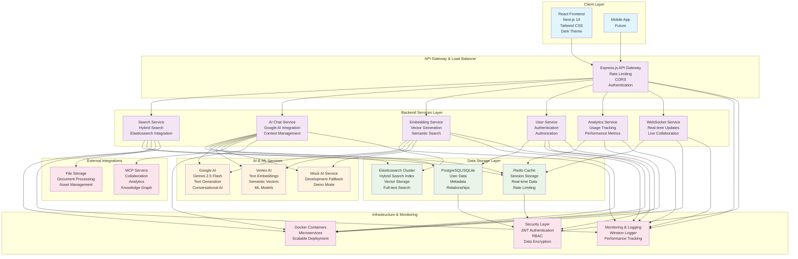
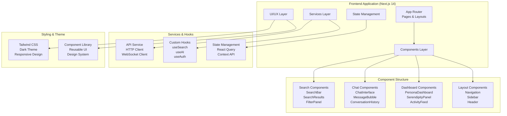
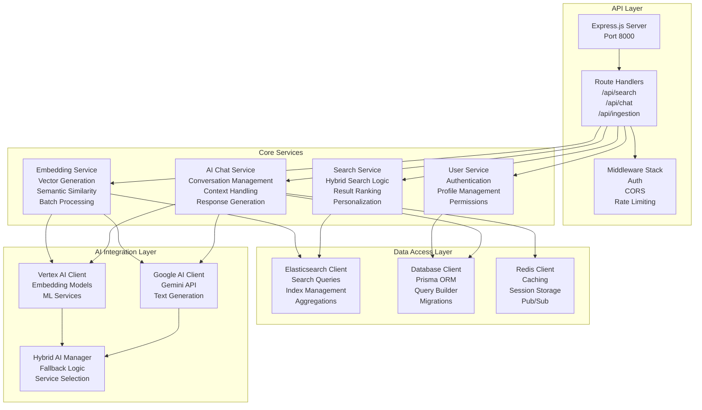
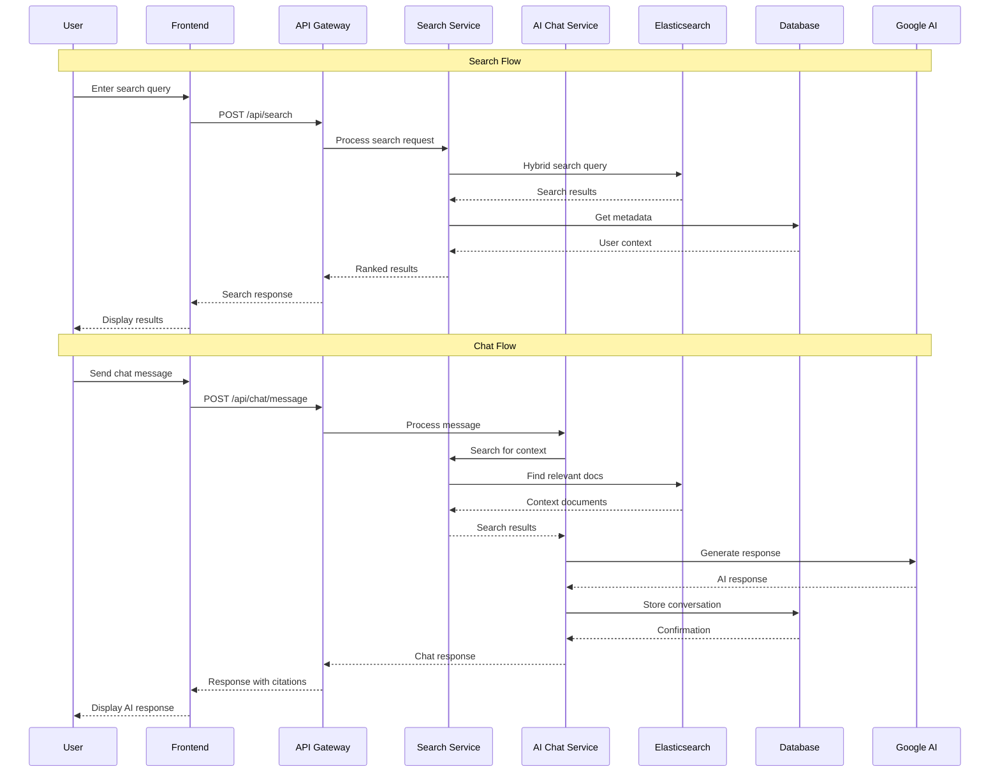
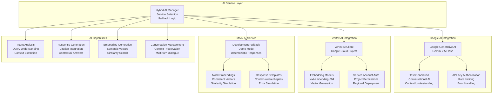
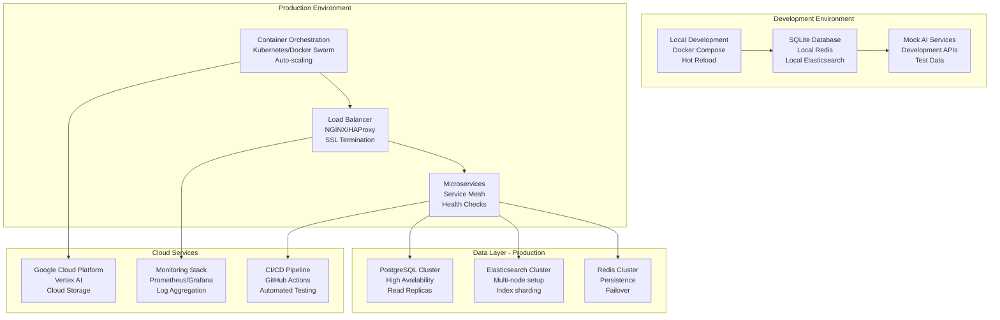

# CollectiveMind Architecture Documentation

## System Overview

CollectiveMind is a cloud-native AI-powered organizational knowledge platform that combines Elasticsearch hybrid search with Google Cloud AI services to create an intelligent memory system for teams.

## High-Level Architecture Diagram



## Detailed Component Architecture

### Frontend Architecture



### Backend Services Architecture



### Data Flow Architecture



### Elasticsearch Index Architecture

```mermaid
graph TB
    subgraph "Elasticsearch Cluster"
        A[knowledge_items Index<br/>Primary Content]
        B[collectivemind-messages Index<br/>Chat History]
        C[collectivemind-people Index<br/>User Profiles]
        D[collectivemind-topics Index<br/>Topic Taxonomy]
    end
    
    subgraph "knowledge_items Schema"
        A1[Document Fields<br/>• title (text)<br/>• content (text)<br/>• summary (text)<br/>• tags (keyword)<br/>• category (keyword)<br/>• author (keyword)]
        A2[Vector Fields<br/>• embedding (dense_vector)<br/>• dimensions: 768<br/>• similarity: cosine]
        A3[Metadata Fields<br/>• created_at (date)<br/>• updated_at (date)<br/>• views (integer)<br/>• relevance_score (float)]
    end
    
    subgraph "Search Capabilities"
        B1[Hybrid Search<br/>• Keyword matching (BM25)<br/>• Semantic similarity<br/>• Result fusion (RRF)]
        B2[Aggregations<br/>• Team facets<br/>• Category filters<br/>• Time ranges<br/>• Content types]
        B3[Suggestions<br/>• Auto-complete<br/>• Query suggestions<br/>• Related topics]
    end

    A --> A1
    A --> A2
    A --> A3
    
    A --> B1
    A --> B2
    A --> B3
```

### AI Service Architecture



### Security Architecture

```mermaid
graph TB
    subgraph "Authentication Layer"
        A1[JWT Tokens<br/>Access & Refresh<br/>15min / 7day expiry]
        A2[User Sessions<br/>Redis Storage<br/>Session Management]
        A3[Role-Based Access<br/>User/Moderator/Admin<br/>Permission Matrix]
    end
    
    subgraph "API Security"
        B1[Rate Limiting<br/>100 req/15min<br/>IP-based throttling]
        B2[CORS Policy<br/>Origin validation<br/>Credential handling]
        B3[Input Validation<br/>Zod schemas<br/>Sanitization]
        B4[Security Headers<br/>Helmet.js<br/>CSP/HSTS]
    end
    
    subgraph "Data Security"
        C1[Database Encryption<br/>At-rest encryption<br/>Connection security]
        C2[API Key Management<br/>Environment variables<br/>Secret rotation]
        C3[PII Protection<br/>Data anonymization<br/>GDPR compliance]
    end
    
    subgraph "Infrastructure Security"
        D1[Container Security<br/>Docker best practices<br/>Minimal attack surface]
        D2[Network Security<br/>VPC isolation<br/>Firewall rules]
        D3[Monitoring & Auditing<br/>Access logs<br/>Security events]
    end

    A1 --> A2
    A2 --> A3
    
    B1 --> B2
    B2 --> B3
    B3 --> B4
    
    C1 --> C2
    C2 --> C3
    
    D1 --> D2
    D2 --> D3
```



### Deployment Architecture



## Technology Stack Summary

### Frontend Stack
- **Framework**: Next.js 14 with App Router
- **Language**: TypeScript
- **Styling**: Tailwind CSS with Dark Theme
- **State Management**: React Query + Context API
- **Real-time**: Socket.io Client
- **Build Tool**: Webpack (Next.js built-in)

### Backend Stack
- **Runtime**: Node.js 18+
- **Framework**: Express.js
- **Language**: TypeScript
- **ORM**: Prisma
- **Authentication**: JWT
- **Logging**: Winston
- **Process Management**: PM2/Docker

### Data Stack
- **Search Engine**: Elasticsearch 8.x
- **Primary Database**: PostgreSQL (SQLite for demo)
- **Cache/Sessions**: Redis
- **Vector Storage**: Elasticsearch dense_vector
- **File Storage**: Local/Cloud Storage

### AI/ML Stack
- **Primary AI**: Google AI (Gemini 2.5 Flash)
- **Embeddings**: Vertex AI (text-embedding-004)
- **Fallback**: Mock AI Service
- **Vector Similarity**: Cosine similarity
- **Context Management**: Custom conversation handling

### Infrastructure Stack
- **Containerization**: Docker
- **Orchestration**: Kubernetes (production)
- **Monitoring**: Winston + Custom metrics
- **Security**: Helmet.js, CORS, Rate limiting
- **CI/CD**: GitHub Actions
- **Cloud**: Google Cloud Platform

## Key Architectural Decisions

### 1. Hybrid Search Architecture
- **Decision**: Combine keyword (BM25) and semantic (vector) search
- **Rationale**: Provides both precise matches and contextual understanding
- **Implementation**: Elasticsearch with dense_vector fields + RRF fusion

### 2. AI Service Abstraction
- **Decision**: Create hybrid AI service with multiple providers
- **Rationale**: Ensures reliability and allows graceful fallbacks
- **Implementation**: Google AI → Vertex AI → Mock AI fallback chain

### 3. Microservices with Shared Database
- **Decision**: Separate services but shared data layer
- **Rationale**: Balance between modularity and data consistency
- **Implementation**: Service-oriented architecture with Prisma ORM

### 4. Real-time Capabilities
- **Decision**: WebSocket integration for live updates
- **Rationale**: Enable collaborative features and real-time search
- **Implementation**: Socket.io with Redis pub/sub

### 5. Dark Theme First
- **Decision**: Default to dark theme with light theme support
- **Rationale**: Modern UX preference and reduced eye strain
- **Implementation**: Tailwind CSS with class-based theme switching

This architecture provides a scalable, maintainable, and feature-rich platform for organizational knowledge management with AI-powered search and collaboration capabilities.